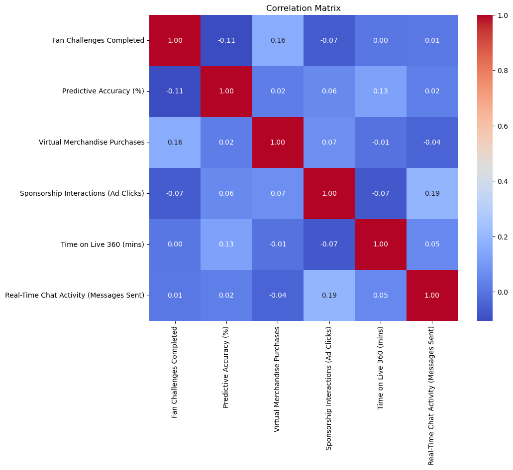
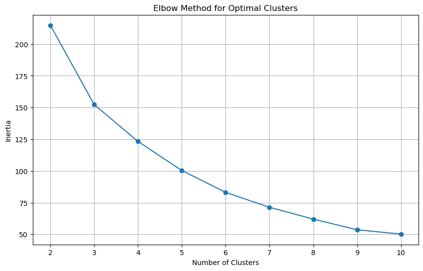
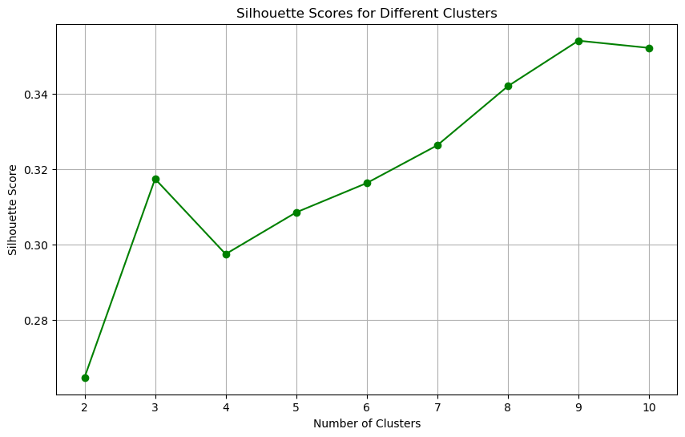
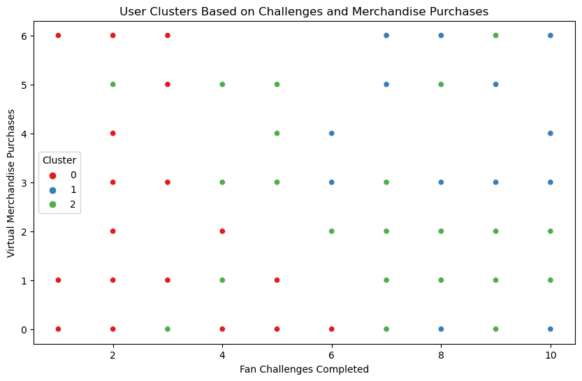

## Personal Note

As a data enthusiast and fan of community engagement, I found this project to be both challenging and rewarding. The analysis allowed me to deepen my understanding of user behavior and hone my skills in data analysis and interpretation. I'm particularly interested in applying these insights to create more engaging user experiences and drive business outcomes. Working for the Xtern application has reinforced my passion for using data to create meaningful impact and help those around me, including businesses and the larger community.

---

# Raj Yadav Xtern Fan Engagement Analysis

This project explores user behavior and engagement within a fan community. By analyzing data on factors like merchandise purchases and participation in fan challenges, we aim to develop strategies to:

1. Boost user engagement
2. Increase merchandise sales

The analysis was conducted using Python libraries like pandas, matplotlib, seaborn, and scikit-learn for data processing and visualization.

## Data

The data for this analysis is sourced from a CSV file provided by Xtern. We performed essential cleaning steps, such as removing missing values and converting specific columns for more effective handling.

## Analysis

### 1. Exploratory Data Analysis (EDA)

  **a. Descriptive Statistics:**

We generated descriptive statistics to understand the data distribution. This provided insights into central tendencies (mean, median) and variability (standard deviation) across various features.

  **b. Correlation Matrix:** 

  

The correlation matrix helps visualize relationships between variables, allowing us to identify correlations between user behavior and factors like merchandise purchases or engagement metrics.

### Strong Positive Correlation:
1. **Fan Challenges Completed and Virtual Merchandise Purchases:** Users who complete more challenges tend to purchase more merchandise.
2. **Predictive Accuracy (%) and Time on Live 360 (mins):** Users with higher predictive accuracy spend more time watching live events.
3. **Sponsorship Interactions (Ad Clicks) and Real-Time Chat Activity (Messages Sent):** More active users in chat and ad clicks are likely to engage more with the platform.

### 2. Key Findings from EDA

From our exploratory data analysis, we identified several key findings:

- Users who complete more fan challenges are more likely to purchase merchandise.
- Higher predictive accuracy correlates with increased time watching live events.
- There is a positive relationship between chat activity and ad clicks.
- Approximately 40% of users have purchased virtual merchandise.

### 3. Clustering Analysis

  **a. K-Means Clustering:**

We used K-Means clustering to segment users based on their behavior, helping us identify distinct user groups with unique characteristics.

  **b. Elbow Method and Silhouette Score:**

  
  

The elbow method and silhouette score analysis helped us determine the optimal number of clusters for our data. By examining these plots, we found that 4 clusters best represent user behavior.

### Elbow Method: 
The elbow method plots the within-cluster sum of squares (WCSS) against the number of clusters (k). As the number of clusters increases, WCSS tends to decrease. However, beyond a certain point, the rate of decrease slows, creating an "elbow" shape on the graph. This elbow point indicates a balance between minimizing WCSS and avoiding overfitting. In our analysis, the elbow point appeared at k = 4, suggesting this is the optimal number of clusters for our dataset.

### Silhouette Score: 
The silhouette score measures how similar an object is to its own cluster compared to other clusters. The score ranges from -1 to 1, with a value closer to 1 indicating that the data point is well matched to its cluster. We calculated silhouette scores for different values of k and found that the score peaked at k = 4. This reinforced our choice from the elbow method, indicating that four clusters provide the best separation between user segments in terms of engagement behaviors.

Combining insights from both methods, we confidently determined that k = 4 is the most suitable number of clusters for our analysis.

  **c. Cluster Characteristics:**

Each cluster represents a distinct user group with unique characteristics. Analyzing these clusters enables us to develop targeted strategies for engaging each group effectively.

### 4. Visualization (Cluster Plot) 

This visualization depicts the distribution of users across the identified clusters, helping us understand the relative sizes and characteristics of each user group.

## Proposed Fan Challenge

To increase engagement during live events and drive merchandise purchases, we propose the "Live 360 Engagement Challenge." This challenge encourages participation in live polls and discussions, rewarding users with points redeemable for exclusive virtual merchandise.

## Recommendations

1. **Targeted Strategies:** Develop tailored approaches for each user cluster based on their specific behavior and preferences.
2. **Personalized Content:** Leverage user data to deliver more relevant content to each user.
3. **Community Building:** Foster a more active and engaged community through chat and sponsored content.
4. **Challenge Evaluation:** Implement and track the proposed challenge to measure its effectiveness in driving engagement and sales.
5. **Continuous Analysis:** Regularly analyze user data to identify emerging trends and potential areas for improvement.

## Limitations

1. The analysis is based on a limited dataset, which may not fully capture the complexity of user behavior.
2. The findings may not be generalizable to other fan communities.

## Conclusion

This analysis offers valuable insights into user behavior and the impact of fan challenges. By implementing the recommended strategies, we can create a more engaging and revenue-generating platform for the fan community.

---
